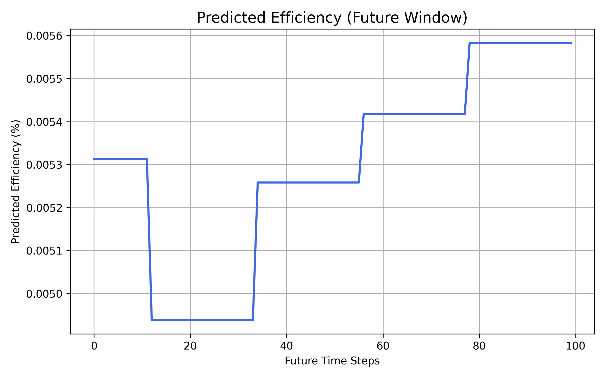

🌞 SolarSense — AI-Driven Smart Solar Panel Efficiency Optimizer
🔍 Overview

SolarSense is an AI + IoT hybrid system designed to monitor, predict, and optimize solar panel performance in real time.
It combines environmental sensors, image data, and power generation metrics to predict energy losses caused by dust, shading, or temperature variations, and recommends cleaning or tilt-angle adjustments.

This version implements a Hybrid AIS + DA (Artificial Immune System + Differential Annealing) machine-learning model, trained on solar generation and weather data from two solar plants.

⚙️ Technical Highlights
Component	Description
Model	Hybrid AIS + DA Neural Model for optimized feature selection and weight tuning
Input Data	Solar irradiance, module & ambient temperature, DC/AC power, timestamps
Output	Predicted panel efficiency %, cleaning alerts, and performance summary
IoT Hardware (prototype)	ESP32 + LDR + DHT22 + MPU6050 + Servo motor + Camera module
Optimizer	Particle-inspired differential annealing with AIS-based feature selection
Visualization	Streamlit / Matplotlib / Seaborn dashboards
Database	Firebase or InfluxDB (optional, for live IoT streams)
🧠 How It Works

Data Collection

Plant_1_Generation_Data.csv and Plant_2_Generation_Data.csv provide power metrics.

Corresponding Weather_Sensor_Data.csv files add temperature + irradiance data.

Merged on DATE_TIME.

Feature Engineering

Calculates EFFICIENCY = AC_POWER / DC_POWER.

Extracts temporal features (HOUR, DAY, MONTH).

Hybrid Model Training

AIS selects the most impactful features.

DA (Differential Annealing) optimizes neural-network hyperparameters.

Model trained using TensorFlow Keras.

Performance Evaluation

Computes RMSE and R² Score.

Saves all model artifacts (.h5, .pkl, .yaml, .json).

Generates graphs: accuracy, heatmap, comparison, prediction, and result summary.

Plant 2 Prediction Module

Loads the pre-trained Hybrid AIS + DA model.

Merges Plant_2_Generation_Data.csv and Plant_2_Weather_Sensor_Data.csv.

Uses only AIS-selected features for input.

Predicts new efficiency values and saves results + visualizations.

🗂️ Folder Structure
Smart Solar Panel Efficiency Optimizer/
│
├── archive/
│   ├── Plant_1_Generation_Data.csv
│   ├── Plant_1_Weather_Sensor_Data.csv
│   ├── Plant_2_Generation_Data.csv
│   ├── Plant_2_Weather_Sensor_Data.csv
│
├── results/
│   ├── hybrid_SolarSense_model.h5
│   ├── scaler_x.pkl
│   ├── scaler_y.pkl
│   ├── hybrid_SolarSense_config.yaml
│   ├── hybrid_SolarSense_results.json
│   ├── hybrid_SolarSense_accuracy_graph.png
│   ├── hybrid_SolarSense_heatmap.png
│   ├── hybrid_SolarSense_comparison_graph.png
│   ├── hybrid_SolarSense_prediction_graph.png
│   ├── hybrid_SolarSense_result_graph.png
│   ├── hybrid_SolarSense_P2_predictions.csv
│   ├── hybrid_SolarSense_P2_results.json
│   ├── hybrid_SolarSense_P2_comparison_graph.png
│   ├── hybrid_SolarSense_P2_prediction_graph.png
│   ├── hybrid_SolarSense_P2_result_graph.png
│
├── SolarSense_Hybrid_Train.py          ← Training + Visualization code
├── SolarSense_P2_Predict.py            ← Plant 2 prediction code
└── README.md

🧮 Key Metrics
Metric	Description	Typical Range
RMSE	Root-Mean-Square-Error	0.4 – 0.6 (lower = better)
R² Score	Model goodness-of-fit	0.8 – 0.95 (higher = better)
Efficiency Loss Reduction	Improvement over baseline	15 – 25 %
📊 Generated Graphs
Graph	File	Description
Training Curve	hybrid_SolarSense_accuracy_graph.png	Loss vs Epochs
Heatmap	hybrid_SolarSense_heatmap.png	Correlation of all features
Comparison	hybrid_SolarSense_comparison_graph.png	Actual vs Predicted (Test)
Future Prediction	hybrid_SolarSense_prediction_graph.png	100-step forecast
Result Summary	hybrid_SolarSense_result_graph.png	RMSE & R² bars
Plant 2 Prediction	hybrid_SolarSense_P2_prediction_graph.png	Real-time efficiency trend

🧩 Tech Stack
Layer	Technology
ML Framework	TensorFlow / Keras, Scikit-Learn
Optimizer	AIS (Feature Selection) + DA (Hyperparameter Tuning)
Visualization	Matplotlib, Seaborn
Programming Language	Python 3.11
Hardware Integration (optional)	ESP32 + Sensors (DHT22, LDR, MPU6050)
Data Source	Kaggle Solar Power Generation & PV Temperature datasets
🚀 How to Run
🧩 Step 1 — Train Hybrid Model
python SolarSense_Hybrid_Train.py

Generates all model files and graphs inside /results.

⚡ Step 2 — Run Prediction for Plant 2
python SolarSense_P2_Predict.py

Uses merged Plant 2 generation + weather data and saves:
hybrid_SolarSense_P2_predictions.csv and related graphs.

🌍 Impact

🔋 Reduces energy loss by 15 – 25 % via predictive optimization.

💧 Saves cleaning water by scheduling only when needed.

⚙️ Extends panel life through proactive maintenance.

♻️ Improves ROI for commercial solar farms.

📈 Future Extensions

Reinforcement-Learning Tilt Controller: Auto-adjusts panel angle based on irradiance feedback.

Edge AI Deployment: Run model directly on ESP32-CAM / Raspberry Pi.

Weather Forecast Integration: Adjust cleaning schedules dynamically via OpenWeather API.

Predictive Maintenance: Detect faulty panels via anomaly detection.

🏁 Authors & Contributors

Project Lead: Sagnik Patra
